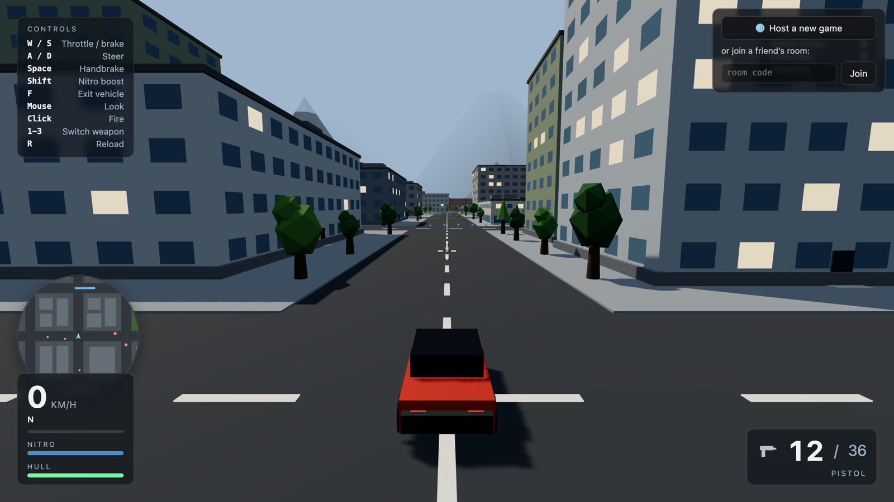
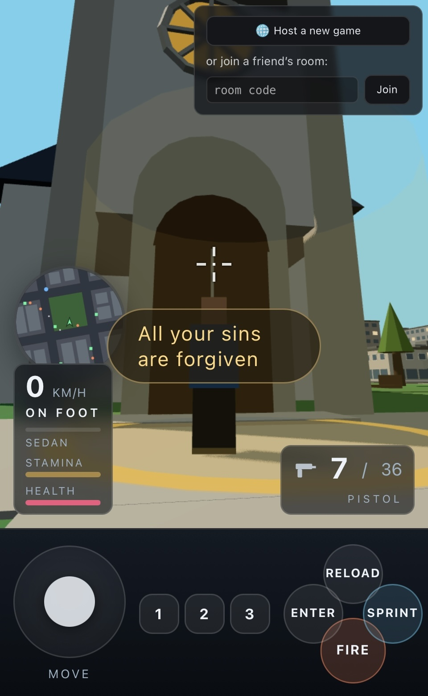

# Poly City — playable build

This repository holds **only the compiled game**. It is generated and force-pushed
by CI from a private source repository; nothing here is edited by hand, and any
commit made directly to it will be overwritten on the next deploy.

**▶ Play: https://wolfatthegate.github.io/poly-city/**

<table>
  <tr>
    <td width="70%"></td>
    <td width="30%"></td>
  </tr>
  <tr>
    <td align="center"><b>Desktop</b> — keyboard and mouse</td>
    <td align="center"><b>Phone</b> — on-screen pad</td>
  </tr>
</table>

The source is private. This repository exists so the game can be played in a
browser without publishing the source.

Copyright © 2026 Wolf Walker. All rights reserved — see [LICENSE](LICENSE).
