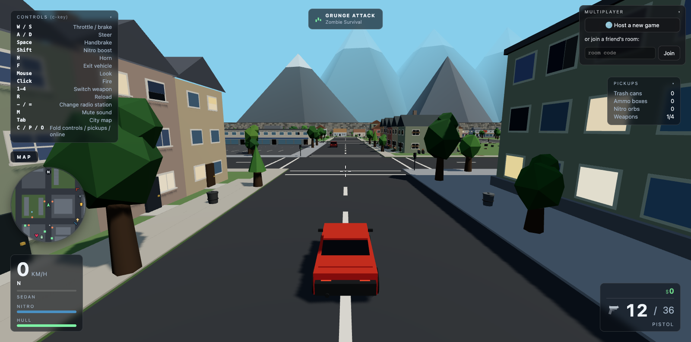
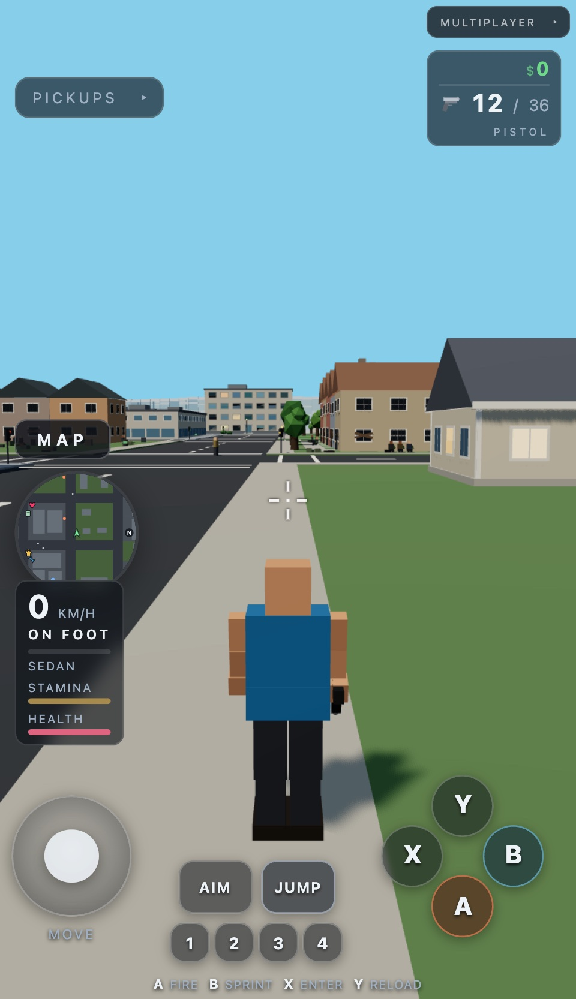

# Shardtown

**▶ Play: https://wolfatthegate.github.io/poly-city/**

A low-poly open-world driving and action game that runs in your browser. There's nothing to install and no sign-up.

Drive, walk and fly through three cities: **Shardtown**, **Santa Fe** and **Prague**. Travel between them by bus or plane. Choose a mode at the start:

- **Free Roam:** drive, shoot and explore, with no clock and no objective.
- **Bomb Defusal:** find the device before the timer runs out, and cut it.
- **Zombie Survival:** escape the city. Fuel up, rescue survivors, dodge the brutes and get out alive.

Earn money on the streets and spend it at the gun shop, the clothing shop and the mechanic. Play solo, or host a game and send friends the link. It works with keyboard and mouse on a desktop, and with an on-screen pad on a phone.

<table>
  <tr>
    <td width="70%"></td>
    <td width="30%"></td>
  </tr>
  <tr>
    <td align="center"><b>Desktop</b>: keyboard and mouse</td>
    <td align="center"><b>Phone</b>: on-screen pad</td>
  </tr>
</table>

---

This repository holds **only the compiled game**. It's generated and force-pushed by CI from a private source repository; nothing here is edited by hand, and any commit made directly to it is overwritten on the next deploy.

Copyright © 2026 WolfAtTheGate LLC and contributors. All rights reserved. See [LICENSE](LICENSE).
